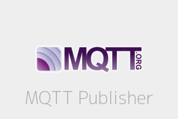

# Publishers

Publishers are classes that publish the monitored conditions to any destination. i.e: MQTT broker, REST service, log file,...

IOTConnect comes with the following built-in publishers:

